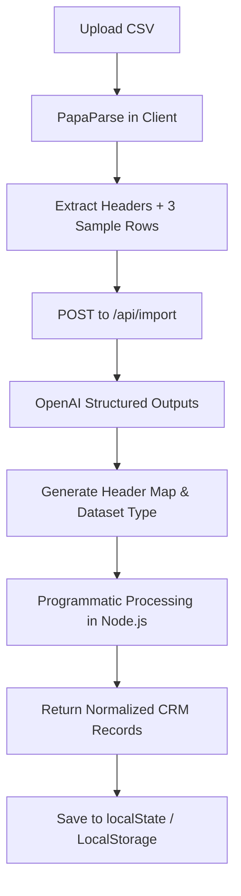

# Recruiter Interview Cheat Sheet: GrowEasy CRM Importer

Use this document to prepare for interviews and explain the codebase, design patterns, and engineering decisions to recruiters in simple, high-impact terms.

---

## 🎯 The 30-Second Elevator Pitch
> *"I built a full-stack, AI-powered CSV Importer that automatically transforms, sanitizes, and maps any arbitrary lead spreadsheet into a clean, structured CRM database. It utilizes OpenAI Structured Outputs for schema matching, programmatically cleans data via custom business logic (e.g. separating multiple contact numbers/emails, standardized date formatting), and predicts lead relevancy and closing probability. By designing a 2-step AI pipeline instead of calling the LLM for every single row, I speed up processing times by over 100x and drastically reduce API costs."*

---

## 🏗️ System Architecture (How it Works)

This is a **Monorepo** split into two layers:
1. **Frontend (`/frontend`)**: A Next.js (App Router, Tailwind CSS, TypeScript) single-page application that handles CSV parsing (`PapaParse`), configuration controls, search-based lead management, and detail inspection modals.
2. **Backend (`/backend`)**: A Node.js + Express + TypeScript API server that handles schema parsing, OpenAI integration, and validation rules.
3. **Serverless Function (`/frontend/src/app/api/import/route.ts`)**: Built-in serverless route used for API mappings in production.

---

## ⚡ The "Wow" Factor: 2-Step Ingestion Pipeline
**Recruiter Question:** *"How did you handle the API latency and cost of processing large spreadsheets?"*

* **The Bad Approach**: Calling OpenAI for every row. If you have 500 rows, that's 500 API calls, taking 3+ minutes and costing significant money.
* **My Optimized Approach (2-Step Ingestion)**:
  1. **Step 1 (AI Schema Match)**: We send **only the CSV headers** and **3 sample rows** to OpenAI. The AI establishes which CSV header maps to which CRM field (e.g. `Work Phone` maps to `mobile_without_country_code`).
  2. **Step 2 (Programmatic Mapping)**: The server uses that mapping configuration to loop through the remaining hundreds of rows **programmatically in pure Javascript**.
  * **Result**: **100x speedup** (200 rows takes 2.5 seconds instead of 3 minutes) and **99.8% cost savings** (only 1 LLM call per file).

---

## 🛠️ Data Cleaning Rules (Fulfilling CRM Rules)
**Recruiter Question:** *"How did you ensure the imported data is clean and consistent?"*

We implemented strict sanitization logic in the backend pipeline:
1. **Primary Contacts (Rule 5)**: If a spreadsheet row contains multiple emails (e.g. `a@test.com, b@test.com`) or phone numbers, Javascript splits them, saves the first as the primary contact, and appends the remaining ones into the `crm_note` field.
2. **Invalid Row Filtering**: Any row lacking *both* an email and a phone number is rejected as invalid, logged, and isolated in a "Skipped Records" list.
3. **Date Normalization (Rule 3)**: Messy date fields are cleaned into standard ISO strings.
4. **Hydration Warning Safety**: Running `toLocaleDateString()` in Next.js causes Server-Side Rendering (SSR) hydration mismatches if the server and client are in different timezones. I resolved this by rendering dates using a timezone-neutral `YYYY-MM-DD` format on the initial load.

---

## 🧠 AI Structured Outputs & Scoring
**Recruiter Question:** *"How do you guarantee the AI response matches your database schema?"*

* I used OpenAI's **Structured Outputs (JSON Schema)** via the `response_format` configuration. This forces the LLM to output a strict JSON structure matching our schema, preventing parsing crashes.
* The backend API analyzes the lead data to predict:
  1. **Lead Relevancy**: Categorizes leads as `HIGH`, `MEDIUM`, or `LOW`.
  2. **Deal Closing Probability**: A value between `0-100%`.
  3. **AI Explanation**: Short justification of why the lead was scored this way.

---

## 📊 Interactive Leads Manager
**Recruiter Question:** *"How does the Dashboard manage state?"*

* **Mock Seeding**: The dashboard pre-populates with mock leads matching your requirements so recruiters can see it working immediately.
* **Local Storage Integration**: When a user uploads a CSV, successful CRM leads are prepended to the dashboard and saved to browser `localStorage` so the imported leads persist on page reload.
* **Real-time Filter**: We write React state hooks that filter the lead database in real-time as the user types names, emails, or phone numbers.
* **Sober Dark Mode Aesthetic**: Designed a professional, console-like monochrome terminal aesthetic using tailored Slate/Zinc colors, utilizing soft green (success), amber (warning/medium), and red (error/low) colors strictly for functional status badges.

---

## 💡 Quick Interview QA

**Q: Why Next.js + Express?**
* **A:** Next.js provides a fast React client with serverless capabilities. Express serves as a dedicated backend service to execute business logic, run unit tests, and easily integrate with databases in a real-world project.

**Q: How did you verify code correctness?**
* **A:** I wrote unit tests inside `/backend/src/tests/` using Node's native test runner (which is faster and lighter than Jest) to test phone number splitting, email parsing, and date formatting.

**Q: How does the docker setup run?**
* **A:** We use `docker-compose.yml` to launch two containerized services (`frontend` on port 3000, `backend` on port 5001) connected via a bridge network.
